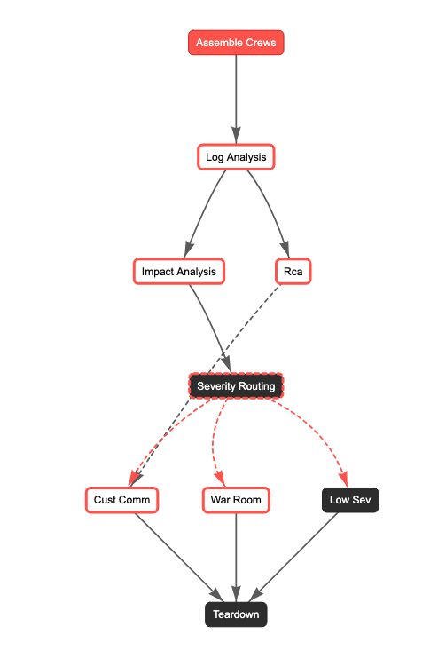
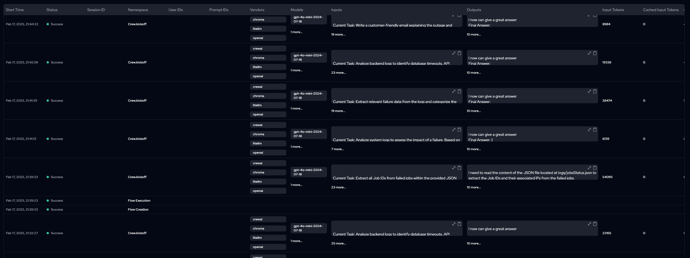
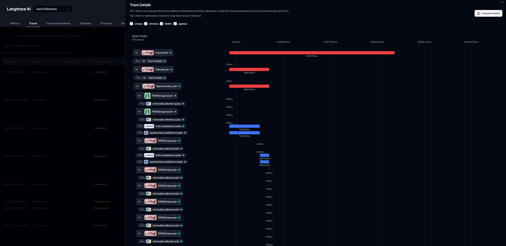

# SherLOG Holmes

16 Agents - 5 Crews with Tracing using Langtrace with API support

Kickoff CrewAI flows through API 

#### CREWS
1. Log Analysis Crew - Looks at different log fails (python, jobs, Network) and aggregates failures
2. Impact Analysis Crew - Infer the impact of the failures and assign a severity score along with drafting a pager duty notification
3. Root Cause Analysis Crew - Generate both a technical and a Non-technical RCA report, this also has an internet researcher agent.
4. Customer Communication Crew - Creates an Email and a list of possible questions with answers a customer facing the issue might ask the support team, a human reviewer is also part of this crew in the form of Human in the Loop Feedback. 
5. War Room Crew - Consists of Senior Backend Engineer, Senior Network Engineer, Principal Architect (with access to Knowledge Base), and Product manager who work together to suggest and try out possible solutions taking into consideration business risks associated with these technical issues. 

#### CREWAI FLOW
- Based on the severity below routing happens in the flow 

- `sev:low`
  -  goes to Low Sev Function

- `sev:high`
  - triggers `customer_communication` and `war_room` crews with Human Feedback 

---

#### FastAPI - Kickoff flow through API 

`fastapi run api/app.py`

swagger at `http://localhost:8000/docs` 

With each API call, a `task_id` is assigned, and user uploaded logs are persisted at `file_server/{task_id}`, the flow is kicked-off async and all the associated results from various crews are also dumped at `file_server/{task_id}`

---

Sample Results - `samples_results/`

Logs - `logs/`

Product Architecture (fake) used for Knowledge Base - `knowledge/wiki/`

---

#### FLOW



---

#### Few Commands 

```shell

crewai flow plot # plot the crewai flow

crewai flow kickoff  # To run this crew

uv pip install langtrace-python-sdk # add external libraries

crewai install # install the dependencies

crewai create flow sherlogholmes --provider openai # create initial flow

crewai flow add-crew war_room_crew # add a new crew
```


Define below in .env file

```
MODEL=gpt-4o-mini
LANGTRACE_API_KEY=93d....426...2f9
SERPER_API_KEY=2e6....a..e
OPENAI_API_KEY=sk....
```
---

#### TRACING
- Uses Langtrace to enable tracing and observability in Agents Workflows





